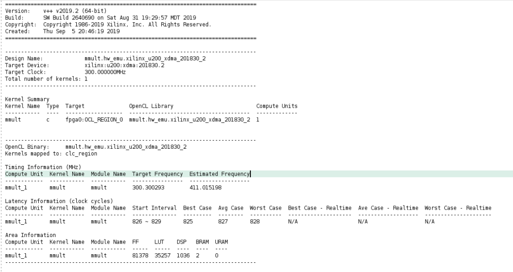

<table>
  <tr>
    <td align="center"><h1>Getting started with RTL Kernels on Alveo Card</h1>
    </td>
  </tr>
</table>

> **IMPORTANT**
>* The content of this tutorial has been extracted from XILINX documentation. 
>* This tutorial is meant to be a recompilation of XILINX documentation about how to build hardware 
>* accelerated applications running on Alveo Data Center accelerator card.

# 1. Introduction
An accelerated application consists of a software program running on an x86 server, and the accelerated kernels running on an Alveo Data Center accelerator card or Xilinx FPGA. The sources for both need to be built (compiled and linked) separately.

This tutorial describes how to build both the software and hardware portions of your design using the `g++` compiler and Vitis compiler. It describes various command line options, including how to specify a target platform, and building for hardware or hardware emulation.

# 2. Tutorial Overview
The contents of this tutorial are structured in the following way:

1. Build the software portion of the design (host program) which will be run on the x86 processor and where the hardware kernel will be called as a function.
2. Create a kernel description XML file.
3. Package the RTL kernel into a Xilinx Object (XO) file.
4. Hardware linking using `v++` command `-l` option to create output binary container (XCLBIN) file.
5. Program RTL kernel onto the FPGA and run in in Hardware or Hardware-Emulation.

# 3. Requirements for Using an RTL Design as an RTL Kernel
To use an RTL kernel within the Vitis IDE, it must meet both the Vitis core development kit execution model and the hardware interface requirements.

## Kernel Execution Model

RTL kernels use the same software interface and execution model as C/C++ kernels. They are seen by the host application as functions with a void return value, scalar arguments, and pointer arguments. For instance:

```C
void vadd_A_B(int *a, int *b, int scalar)
```

This implies that an RTL kernel has an execution model like a software function:

- It must start when called.
- It is responsible for processing the necessary results.
- It must send a notification when processing is complete.

The Vitis core development kit execution model specifically relies on the following mechanics and assumptions:

- Scalar arguments are passed to the kernel through an AXI4-Lite slave interface.
- Pointer arguments are transferred through global memory (DDR, HBM, or PLRAM).
- Base addresses of pointer arguments are passed to the kernel through its AXI4-Lite slave interface.
- Kernels access pointer arguments in global memory through one or more AXI4 master interfaces.
- Kernels are started by the host application through its AXI4-Lite interface.
- Kernels must notify the host application when they complete the operation through its AXI4-Lite interface or a special interrupt signal.

## Hardware Interface Requirements

To comply with this execution model, the Vitis core development kit requires that a kernel satisfies the following specific hardware interface requirements:

- One and only one AXI4-Lite slave interface used to access programmable registers (control registers, scalar arguments, and pointer base addresses).
  - Offset `0x00` - Control Register: Controls and provides kernel status
    - Bit `0`: **start signal**: Asserted by the host application when kernel can start processing data. Must be cleared when the **done** signal is asserted.
    - Bit `1`: **done signal**: Asserted by the kernel when it has completed operation. Cleared on read.
    - Bit `2`: **idle signal**: Asserted by this signal when it is not processing any data. The transition from Low to High should occur synchronously with the assertion of the **done** signal.
  - Offset `0x04`- Global Interrupt Enable Register: Used to enable interrupt to the host.
  - Offset `0x08`- IP Interrupt Enable Register: Used to control which IP generated signal is used to generate an interrupt.
  - Offset `0x0C`- IP Interrupt Status Register: Provides interrupt status
  - Offset `0x10` and above - Kernel Argument Register(s): Register for scalar parameters and base addresses for pointers.

- One or more of the following interfaces:
  - AXI4 master interface to communicate with global memory.
    - All AXI4 master interfaces must have 64-bit addresses.
    - The kernel developer is responsible for partitioning global memory spaces. Each partition in the global memory becomes a kernel argument. The base address (memory offset) for each partition must be set by a control register programmable through the AXI4-Lite slave interface.
    - AXI4 masters must not use Wrap or Fixed burst types, and they must not use narrow (sub-size) bursts. This means that AxSIZE should match the width of the AXI data bus.
    - Any user logic or RTL code that does not conform to the requirements above must be wrapped or bridged.
  - AXI4-Stream interface to communicate with other kernels.

If the original RTL design uses a different execution model or hardware interface, you must add logic to ensure that the design behaves in the expected manner and complies with interface requirements.

## Vector-Accumulate RTL IP

For this tutorial, the Vector-Accumulate RTL IP performing `B[i]=A[i]+B[i]` meets all the requirements described above and has the following characteristics:

- Two AXI4 memory mapped interfaces:
  - One interface is used to read A
  - One interface is used to read and write B
  - The AXI4 masters used in this design do not use wrap, fixed, or narrow burst types.
- An AXI4-Lite slave control interface:
  - Control register at offset `0x00`
  - Kernel argument register at offset `0x10` allowing the host to pass a scalar value to the kernel
  - Kernel argument register at offset `0x18` allowing the host to pass the base address of A in global memory to the kernel
  - Kernel argument register at offset `0x24` allowing the host to pass the base address of B in global memory to the kernel

## Accessing the Tutorial Reference Files
>**IMPORTANT:** Before running the example commands, ensure you have set up the Vitis core development kit by running the following commands:
>
>   ```bash
>    #setup Xilinx Vitis tools. XILINX_VITIS and XILINX_VIVADO will be set in this step.
>    module load vitis
>    #Setup Xilinx runtime. XILINX_XRT will be set in this step.
>    source /opt/xilinx/xrt/setup.sh
>   ```

To access the reference files for this tutoral, type the following into a terminal:

` % mkdir $HOME/tutorial`
` % cd $HOME/tutorial`
` % git clone https://github.com/LeandroDorta/alveo_tutorial`
` % cd alveo_tutorial`
` % TOPDIR=$PWD`

The alveo_tutorial directory is structured in the following way:
```
alveo_tutorial
|___ [Makefile]()
|___ [run_rtl_kernel.sh]()
|___ scripts
|    |___ [gen_xo.tcl]()
|    |___ [package_kernel.tcl]()
|___ src
     |___ host]
     |    |___ [host.cpp]()
     |___ IP
     |    |___ [A_axi_read_master.sv]()
     |    |___ [B_axi_read_master.sv]()
     |    |___ [Vadd_A_B_control_s_axi.v]()
     |    |___ [Vadd_A_B_example_adder.v]()
     |    |___ [Vadd_A_B_example_axi_write_master.sv]()
     |    |___ [Vadd_A_B_example_counter.sv]()
     |    |___ [Vadd_A_B_example.sv]()
     |    |___ [Vadd_A_B_example_vadd.sv]()
     |    |___ [Vadd_A_B.v]()
     |    |___ [Vadd_B.sv]()
     |___ xml
          |___ [kernel.xml]()
``` 


# 4. Host program (Building the Software)
The software program is written in C/C++ and uses OpenCL™ API calls to communicate and control the accelerated kernels. It is built using the standard GCC compiler or using the `g++` compiler, which is a wrapper around GCC.  Each source file is compiled to an object file (.o) and linked with the Xilinx runtime (XRT) shared library to create the executable. For details on GCC and associated command line options, refer to [Using the GNU Compiler Collection (GCC)](https://gcc.gnu.org/onlinedocs/gcc/). For more information about how the host program is structured and the use of OpenCL™ API calls, you can refer to [Developing Applications](https://www.xilinx.com/html_docs/xilinx2019_2/vitis_doc/lhv1569273988420.html).

1. **Compiling the Software Program**

   To compile the host application, use the `-c` option with a list of the host source files.  
Optionally, the output object file name can be specified with the `-o` option as shown below.

    ```bash
    g++ ... -c <source_file_name1> ... <source_file_nameN> -o <object_file_name> -g
    ```

2. **Linking the Software Program**

    To link the generated object files, use the `-l` option and object input files as follows.

     ```bash
     g++ ... -l <object_file1.o> ... <object_fileN.o> -o <output_file_name>
     ```

   >**TIP:** Host compilation and linking can be integrated into one step which does not require the `-c` and `-l` options. Only the source input files are required as shown below.
   >
   >`g++ ... <source_file_name1> ... <source_file_nameN> ... -o <output_file_name>`

3. **Required Flags**

   You will need to specify include paths and library paths for XRT and Vivado tools:  

   1. Use the `-I` option to specify the include directories: `-I$XILINX_XRT/include -I$XILINX_VIVADO/include`
   2. Use the `-L` option to specify directories searched for `-l` libraries: `-L$XILINX_XRT/lib`
   3. Use the `-l` option to specify libraries used during linking: `-lOpenCL -lpthread -lrt -lstdc++`

4. **Complete Command**

   The complete command to build, link, and compile the host program in one step, from the `./reference_files/run` folder, will look like the following.

    ```bash
    g++ -I$XILINX_XRT/include/ -I$XILINX_VIVADO/include/ -Wall -O0 -g -std=c++11 \
    /src/host/host.cpp  -o 'host'  -L$XILINX_XRT/lib/ -lOpenCL -lpthread -lrt -lstdc++
    ```

   >**Command Options and Descriptions**
   >
   >* `-I../libs`, `-I$XILINX_XRT/include/`, and `-I$XILINX_VIVADO/include/`: Include directory
   >* `-Wall`: Enable all warnings
   >* `-O0`: Optimization option (execute the least optimization)
   >* `-g`: Generate debug info
   >* `-std=c++11`: Language Standard (define the C++ standard, instead of the include directory)
   >* `../src/host.cpp`: Source files
   >* `-o 'host'`: Output name
   >* `-L$XILINX_XRT/lib/`: Look in XRT library
   >* `-lOpenCL`, `-lpthread`, `-lrt`, and `-lstdc++`: Search the named library during linking

# 5. RTL Kernel (Building the Hardware)
Next, you need to build the kernels that run on the hardware accelerator card.  Like building the host application, building kernels also requires compiling and linking. The hardware kernels can be coded in C/C++, OpenCL C, or RTL. The C/C++ and OpenCL C kernels are compiled using the Vitis compiler, while RTL-coded kernels are compiled using the Xilinx `package_xo` utility.

For details on both `v++` and `package_xo`, refer to the [Vitis Environment Reference Materials](https://www.xilinx.com/html_docs/xilinx2019_2/vitis_doc/yxl1556143111967.html). Regardless of how each kernel is compiled, both methods generate a Xilinx object file (XO) as an output.

The object files are subsequently linked with the shell (hardware platform) through the Vitis compiler to create the FPGA binary file, or xclbin file.

The following figure shows the compiling and linking flow for the various types of kernels.  

  [compiling_and_linking_flow](vitis.png)

This tutorial is limited to `package_xo` compilation of RTL kernels.

RTL kernels are compiled and linked using the Xilinx package_xo utility. 

The package_xo command is a Tcl command within the Vivado Design Suite. It is used to generate a Xilinx object file (.xo) from an RTL kernel. 

**Syntax**
package_xo  -kernel_name <arg> [-force] [-kernel_xml <arg>] [-design_xml <arg>]
            [-ip_directory <arg>] [-parent_ip_directory <arg>]
            [-kernel_files <args>] [-kernel_xml_args <args>]
            [-kernel_xml_pipes <args>] [-kernel_xml_connections <args>]
            -xo_path <arg> [-quiet] [-verbose]

| Argument | Description |
| --- | --- |
| `-kernel_name <arg>` | Required. Specifies the name of the RTL kernel. |
| `-force` | (Optional) Overwrite an existing .xo file if one exists. |
| `-kernel_xml <arg>` | (Optional) Specify the path to an existing kernel XML file. |
| `-design_xml <arg>` | (Optional) Specify the path to an existing design XML file |
| `-ip_directory <arg>	` | (Optional) Specify the path to the kernel IP directory. |
| `-parent_ip_directory	` | (Optional) If the kernel IP directory specified contains multiple IPs, specify a directory path to the parent IP where its component.xml is located directly below. |
| `-kernel_files` | (Optional) Kernel file name(s). |
| `-kernel_xml_args <args>	` | (Optional) Generate the kernel.xml with the specified function arguments. |
| `-kernel_xml_pipes <args>	` | (Optional) Generate the kernel.xml with the specified pipe(s) |
| `-kernel_xml_connections <args>	` | (Optional) Generate the kernel.xml file with the specified connections. |
| `-xo_path <arg>	` | (Required) Specifies the path and file name of the compiled object (.xo) file |
| `-quiet` | (Optional) Execute the command quietly, returning no messages from the command. The command also returns TCL_OK regardless of any errors encountered during execution |
| `-verbose` | (Optional) Temporarily override any message limits and return all messages from this command. |

In our case, the command that we are using is the following:
`package_xo -xo_path {xoname} -kernel_name Vadd_A_B -ip_directory ./packaged_kernel_${suffix} -kernel_xml ./src/xml/kernel.xml`

where:
```
{xoname} is .xclbin/$(KERNEL).$(TARGET).$(DEVICE).xo 
{suffix} is "$(KERNEL)_$(TARGET)_$(DEVICE)"
  $(KERNEL): vadd
  $(TARGET): hw
  $(DEVICE): xilinx_u250_xdma_201830_2
```

## XML file
As it can be seen, a kernel description XML file is needed by the `package_xo` command to create an RTL kernel that can be used in the SDAccel environment (it is necessary one per kernel). The file must be called `kernel.xml`. The XML file specifies kernel attributes like the register map and ports which are needed by the runtime and SDAccel flows. The following is the structure of our `kernel.xml` file:
```
<?xml version="1.0" encoding="UTF-8"?>
<root versionMajor="1" versionMinor="6">
  <kernel name="Vadd_A_B" language="ip_c" vlnv="mycompany.com:kernel:Vadd_A_B:1.0" attributes="" preferredWorkGroupSizeMultiple="0" workGroupSize="1" interrupt="true" hwControlProtocol="ap_ctrl_hs">
    <ports>
      <port name="s_axi_control" mode="slave" range="0x1000" dataWidth="32" portType="addressable" base="0x0"/>
      <port name="m00_axi" mode="master" range="0xFFFFFFFFFFFFFFFF" dataWidth="512" portType="addressable" base="0x0"/>
      <port name="m01_axi" mode="master" range="0xFFFFFFFFFFFFFFFF" dataWidth="512" portType="addressable" base="0x0"/>
    </ports>
    <args>
      <arg name="scalar00" addressQualifier="0" id="0" port="s_axi_control" size="0x4" offset="0x010" type="uint" hostOffset="0x0" hostSize="0x4"/>
      <arg name="A" addressQualifier="1" id="1" port="m00_axi" size="0x8" offset="0x018" type="int*" hostOffset="0x0" hostSize="0x8"/>
      <arg name="B" addressQualifier="1" id="2" port="m01_axi" size="0x8" offset="0x024" type="int*" hostOffset="0x0" hostSize="0x8"/>
    </args>
  </kernel>
</root>

```

The following table describes the format of the kernel XML in detail:
| Tag | Attribute | Description |
| --- | --- | --- |
| `<root>` | versionMajor | Set to 1 for the current release of SDAccel |
|  | versionMinor | Set to 6 for the current release of SDAccel. |
| `<kernel>` | name | Kernel name |
|  | language | Always set it to `ip_c` for RTL kernels.
|  | vlnv | <p>Must match the vendor, library, name, and version attributes in the `component.xml` of an IP. For example, if `component.xml` has the following tags: <br>`<spirit:vendor>xilinx.com</spirit:vendor>` <br> `<spirit:library>hls</spirit:library>` <br> `<spirit:name>test_sincos</spirit:name>` <br> `<spirit:version>1.0</spirit:version>` <br> The vlnv attribute in kernel XML must be set to: <br> `xilinx.com:hls:test_sincos:1.0`</p> |
|  | attributes | Reserved. Set it to empty string. |
|  | preferredWorkGroupSizeMultiple | Reserved. Set it to 0. |
|  | workGroupSize | Reserved. Set it to 1. |
|  | interrupt | Set equal to "true" (that is,. interrupt="true") if interrupt present else omit. |
|  | hwControlProtocol | <p> Set the kernel mode of operation <br> `ap_ctrl_none` for free-running kernels <br> `ap_ctrl_hs` for sequential kernels <br> `ap_ctrl_chain` for pipelined kernels </p>
| `<port>` | name | Port name. At least an AXI4 master port and an AXI4-Lite slave port are required. The AXI4-Stream port can be optionally specified to stream data between kernels. The AXI4-Lite interface name must be `S_AXI_CONTROL`. |
|  | mode | <ul><li>For AXI4 master port, set it to "master."</li><li>For AXI4 slave port, set it to "slave."</li><li>For AXI4-Stream master port, set it to "write_only."</li><li>For AXI4-Stream slave port, set it "read_only."</li></ul> |
|  | range | The range of the address space for the port | 
|  | dataWidth | The width of the data that goes through the port, default is 32 bits |
|  | portType  | <p>Indicate whether or not the port is addressable or streaming. <ul><li>For AXI4 master and slave ports, set it to "addressable."</li><li>For AXI4-Stream ports, set it to "stream."</li></ul></p> |
|  | base | For AXI4 master and slave ports, set to `0x0`. This tag is not applicable to AXI4-Stream ports | 
| `<arg>` | name | Kernel argument name. | 
|  | addressQualifier | <p> Valid values: <br> 0:Scalar kernel input argument <br> 1:global memory <br> 2:local memory <br> 3:constant memory <br> 4:pipe </p> |
|  | id | <p> Only applicable for AXI4 master and slave ports. The ID needs to be sequential. It is used to determine the order of kernel arguments. <br> Not applicable for AXI4-Stream ports </p> |
|  | port | Indicates the port to which the `arg` is connected. |
|  | size | Size of the argument. The default is 4 bytes. |
|  | offset | Indicates the register memory address. |
|  | type | The C data type for the argument. For example, `int*`, `float*`. |
|  | hostOffset | Reserved. Set to `0x0`. |
|  | hostSize | Size of the argument. The default is 4 bytes. | 
|  | memSize  | <p> Not applicable to AXI4 master and slave ports. <br> For AXI4-Stream ports, memSize sets the depth of the created FIFO. </p> | 

The following tags specify additional information for AXI4-Stream ports. They are not applicable to AXI4 master or slave ports.
```
For each pipe in the compute unit, the compiler inserts a FIFO for buffering the data. 
The pipe tag describes configuration of the FIFO.

```
| Tag | Attribute | Description | 
| --- | --- | --- | 
| `<pipe>` | name | This specifies the name for the FIFO inserted for the AXI4-Stream port. This name must be unique among all pipes used in the same compute unit. | 
|  | width | This specifies the width of FIFO in bytes. For example, `0x4` for 32-bit FIFO. | 
|  | depth | This specifies the depth of the FIFO in number of words. | 
|  | linkage | Always set to internal. | 

```
The connection tag describes the actual connection in hardware either from the kernel 
to the FIFO inserted for the PIPE or from the FIFO to the kernel.
```
| Tag | Attribute | Description | 
| --- | --- | --- | 
| `<connection>` | srcInst | Specifies the source instance of the connection. | 
|  | srcPort | Specifies the port on the source instance for the connection. | 
|  | dstInst | Specifies the destination instance of the connection. | 
|  | dstPort | Specifies the port on the destination instance of the connection. | 


## Tcl scripts
Since the `package_xo` is a Tcl command, we utilize a Tcl script to execute it in Vivado batch mode. If you go to `$TOPDIR/scripts/`, you will notice two Tcl scripts: `gen_xo.tcl` and `package_kernel.tcl`. The `gen_xo.tcl` script is used to set the parameters for the `package_xo`. You can check its content by typing the following in the terminal:

```
% cd $TOPDIR/scripts
% less gen_xo.tcl
```

You will notice that this Tcl script is expecting 4 arguments (otherwise it prints out an ERROR message):

`xoname`: The name of the XO object file that will be generated (used as `-xo_path` argument for `package_xo`

`krnl_name`: The name of the RTL kernel (used as `-kernel_name` argument for `package_xo`

`target`: `hw` for hardware implementation

`device`: xilinx_u250_xdma_201830_2

You can also notice that the Tcl script is also sourcing the `package_kernel.tcl` script. This script set different properties and parameters necessary for a correct implementation of the RTL kernel in the Alveo card, such as identifying the source files for the hardware design (from `$TOPDIR/src`). If you want to know more about the content of `package_kernel.tcl`, click [here]().

Now, in order to execute the `package_xo` Tcl command to generate the XO Object file for our RTL kernel, we proceed to run the `gen_xo.tcl` script using Vivado in batch mode. We can do this by typing the following commands in the terminal:
```
% cd $TOPDIR
% /opt/xilinx/Xilinx_Vivado_vitis_2019.2/Vivado/2019.2/bin/vivado -mode batch -source scripts/gen_xo.tcl -tclargs ./xclbin/{kernel name}.{target}.{device}.xo {kernel name} {target} {device}
```
where in our case:
`{kernel name}` : vadd
`{target}` : hw
`{device}` : xilinx_u250_xdma_201830_2

# 6. Hardware Linking
During hardware linking, you will link one or more kernels with the platform to create an output binary container (xclbin) file. The `v++` command `-l` option is used to link the hardware kernels. Linking requires several options including specifying the XO object files, the platform, and the build target. For the available linking options, refer to [Vitis Environment Reference Materials](https://www.xilinx.com/html_docs/xilinx2019_2/vitis_doc/yxl1556143111967.html). The platform and build target options used during linking must match those used during compilation.

The XO object files are specified on the `v++` command by directly listing the object files. Multiple object files can be added.

`v++ … <kernel_xo_file.xo> … <kernel_xo_file.xo>`

There are many options that can be specified during linking stage. For instance, `--nk` is one of them. It is used to specify the number of kernel instances (compute units (CUs)) to create during the linking process. The usage is shown below.

`v++ ... --nk <kernel_name>:<compute_units>:<kernel_name1>:…:<kernel_nameN>`

 >**TIP:** The instance name (`kernel_name1...') is optional, and automatically defined if not specified.

You can also specify the name of the generated output file using the `-o` option. The output file in the link stage will be xclbin file and should be named accordingly.

`v++ ... -o <xclbin_name>.xclbin`

To build the hardware for *hardware emulation*, or for targeting the Alveo Data Center accelerator card *system*, set the `-t` option specifying the <*build_target*> to **hw_emu** for hardware emulation, or **hw** to build for the accelerator card.`

The compile and link `v++` commands for both *hardware emulation* and *system* build targets are provided below.


* **Hardware Emulation Build**

  ```
  v++ -t hw_emu -lo .xclbin/vadd.hw_emu.xilinx_u250_xdma_201830_2.xclbin ./xclbin/vadd.hw_emu.xilinx_u250_xdma_201830_2.xo 
  ```

* **System Build**

   >**IMPORTANT:** Because of the FPGA binary file synthesis and implementation, compiling and linking for the hardware target can take several hours.

   ```
  v++ -t hw -lo .xclbin/vadd.hw_emu.xilinx_u250_xdma_201830_2.xclbin ./xclbin/vadd.hw_emu.xilinx_u250_xdma_201830_2.xo 
  ```
  
>**IMPORTANT**: To organize the logs and reports generated by the v++ command, we can utilize the following flags:
>
>* `--report_dir=`: to set the directory where we want the reports
>* `--log_dir=`: to set the directory where we want the log files

The `v++` commands also generate the `link_summary` file that can be used with the Vitis analyzer to visualize relevant reports.

### Reviewing Hardware Build Reports

During the compile, link, and run stages, the guidance is generated that can have several severity levels: errors, advisories, warnings, and critical warnings. These are provided during software emulation, hardware emulation, and system builds.

For *hardware emulation* and *system builds* targeted builds, a `system_estimate_<kernel_name>.<build_target>.<dsa_name>.xtxt` report file is also automatically generated for both the compilation and linking stages. It provides the estimated FPGA resource usage and estimated frequency of the hardware accelerated kernel.

The Vitis analyzer can be used to open these specific reports or can directly open compile_summary, link_summary, or the run_summary reports generated by the compile, link, and run stage. When these summary reports are opened, the Vitis analyzer automatically opens the relevant reports.

Use the following commands to open these reports.

```
vitis_analyzer compile_summary
vitis_analyzer link_summary
vitis_analyzer run_summary
```


* The following figure shows an example of the guidance report generated during the run stage. This can be opened using the run_summary report.

     

### Putting it All Together

The following steps summarize how to build both the software and hardware targeting hardware system using the source files in this lab.

1. Set up Vitis core development kit.
```
#setup Xilinx Vitis tools. XILINX_VITIS and XILINX_VIVADO will be set in this step.
% module load vitis
#Setup Xilinx runtime. XILINX_XRT will be set in this step.
% source /opt/xilinx/xrt/setup.sh
```

2. Build the host software. 
```
% g++ -I$XILINX_XRT/include/ -I$XILINX_VIVADO/include/ -Wall -O0 -g -std=c++11 \
    /src/host/host.cpp  -o 'host'  -L$XILINX_XRT/lib/ -lOpenCL -lpthread -lrt -lstdc++
```

3. Build the XO object file (executing the Tcl command `package_xo` through the execution of `gen_xo.tcl` using Vivado batch mode.
```
% cd $TOPDIR
% /opt/xilinx/Xilinx_Vivado_vitis_2019.2/Vivado/2019.2/bin/vivado -mode batch -source scripts/gen_xo.tcl -tclargs ./xclbin/{kernel name}.{target}.{device}.xo {kernel name} {target} {device}
```
where in our case:
`{kernel name}` : vadd
`{target}` : hw
`{device}` : xilinx_u250_xdma_201830_2

4. Build the XCLBIN binary file.
```
% cd $TOPDIR
% v++ -t hw -lo .xclbin/vadd.hw_emu.xilinx_u250_xdma_201830_2.xclbin ./xclbin/vadd.hw_emu.xilinx_u250_xdma_201830_2.xo
```
>**IMPORTANT**: For simplicity, you can use the following command from the Makefile to complete steps 2 to 4:
```
% cd $TOPDIR
% make all
```

# 7. Hardware Emulation
Emulation is essential for design debugging and optimization. The Vitis core development kit provides both software and hardware emulation.

This tutorial details the steps to perform hardware emulation. (RTL kernels cannot be software simulated)

For hardware emulation (`hw_emu`), the kernel code is compiled into a hardware model, which is run in a hardware simulator, while the rest of the system uses a C simulator. Building and running takes longer but provides a detailed, cycle-aware, view of kernel activity. This target is useful for testing the functionality of the logic that will run in the FPGA and for getting initial performance estimates.

## Requirements for Running Emulation

To run emulation, it is necessary to:

1. Build the design.
2. Generate an emulation configuration file.
3. Set the XCL_EMULATION_MODE environment variable.

We already built the design, now we will proceed to step 2.

### Emulation Configuration Files
In addition to building the application and targeting a specific emulation mode, it is also necessary to generate an emulation configuration file.

The emulation configuration file, `emconfig.json`, is generated using the `emconfigutil` command and provides information used by the Xilinx runtime (XRT) library during emulation. The `emconfigutil` command is provided in the Vitis core development kit installation.

At a minimum you need to specify the target platform through the `-f` or `-–platform` option to generate the required `emconfig.json`. The specified *platform_target* must be identical to that used during the host and hardware builds. A single `emconfig.json` file can be used for both software and hardware emulation.

```
emconfigutil -–platform <platform_target>
```

For a list of options, run `emconfigutil --help`, or refer to the [Vitis Environment Reference Materials](https://www.xilinx.com/html_docs/xilinx2019_2/vitis_doc/yxl1556143111967.html).

### Define the XCL_EMULATION_MODE Environment Variable

Finally, before running either the hardware emulation, define the XCL_EMULATION_MODE environment variable. This variable is used by the runtime library to correctly execute the desired emulation.

* For hardware emulation, set the variable to `hw_emu`.

   ```
   export XCL_EMULATION_MODE=hw_emu
   ```

### Running emulation
With the configuration file `emconfig.json` generated and XCL_EMULATION_MODE variable set, use the following command to execute the host program and kernel in hardware emulation mode.

   ```bash
   ./host vadd.hw_emu.xilinx_u250_xdma_201830_2.xclbin
   ```

After successfully running hardware emulation, you will see output similar to the following in the Console.

  ```
  Loading: 'mmult.hw_emu.xilinx_u200_xdma_201830_2.xclbin'
  INFO: [Vitis-EM 01] Hardware emulation runs simulation underneath. Using a large data set will result in long simulation times. It is recommended that a small dataset is used for faster execution. This flow does not use cycle accurate models and hence the performance data generated is approximate.
  TEST PASSED
  INFO: [Vitis-EM 22] [Wall clock time: 19:16, Emulation time: 0.00651464 ms] Data transfer between kernel(s) and global memory(s)
  mmult_1:m_axi_gmem-DDR[1]          RD = 2.000 KB               WR = 1.000 KB
  ```
# 8. Execution in Hardware
To proceed with the Execution of the design in Hardware, we must make sure that the application has been built successfully. Once we are done building the application, we must ensure the environment variable XCL_EMULATION_MODE is not set. If you have done the hardware emulation in the previous step, it might have been set to `hw_emu`. Run the following command:

```
% unset XCL_EMULATION_MODE
```

With the host program and hardware platform (xclbin), you can run the application on Xilinx boards or devices.

***Running the application***
```
% cd $TOPDIR
% ./host .xclbin/vadd.hw.xilinx_u250_xdma_201830_2.xclbin
```

After successfully running the application, you will see a similar output in the Console view.

  ```
  Loading: 'mmult.hw.xilinx_u200_xdma_201830_2.xclbin'
  TEST PASSED
  ```

## Using xbutil to Check Board Status and Debug

Using `xbutil` is optional but convenient tool to do analysis and debug related to Xilinx boards. For example, run the following command to check the board status.

  ```bash
  xbutil query
  ```

The board status, compute unit status, and so on display. For more information about `xbutil`, refer to the [Vitis Environment Reference Materials](https://www.xilinx.com/html_docs/xilinx2019_2/vitis_doc/yxl1556143111967.html).
